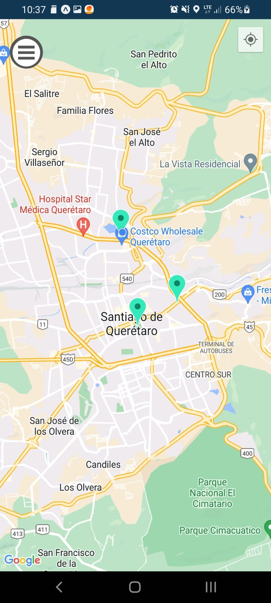

<h1>Aplicación QroTour</h1>
<h2>Iniciar Sesión</h2>

<h2>Registrar</h2>

<h2>Inicio de la app, después del Registro / Inicio de Sesión</h2>

<h2>Ventana emergente del marcador</h2>

<h2>Información extra del marcador</h2>

<h2>Estancia validada</h2>

<h2>Pantalla del Usuario</h2>

<h2>Descuentos por la zona visitada</h2>

<h2>Pantalla del Cupón del Establecimiento Asociado</h2>
